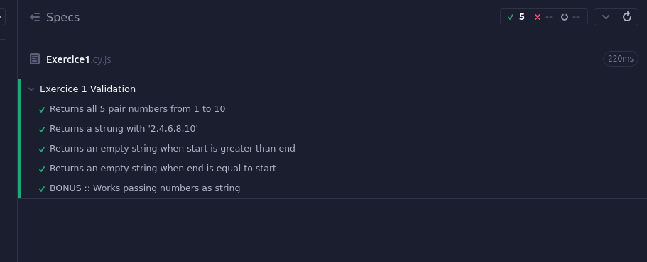
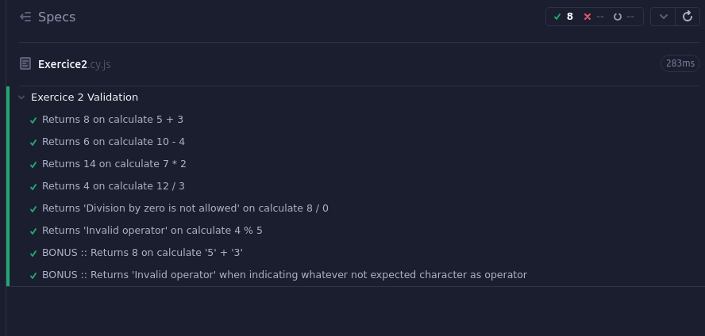
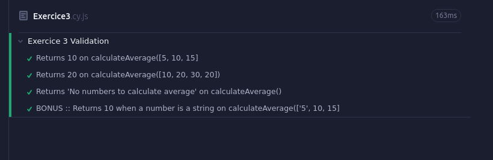
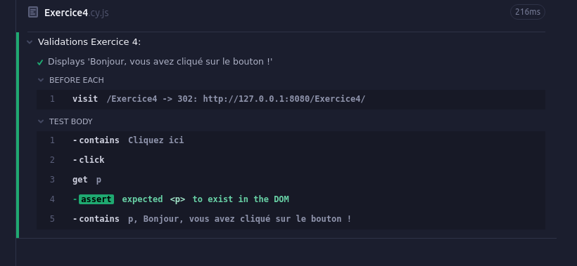
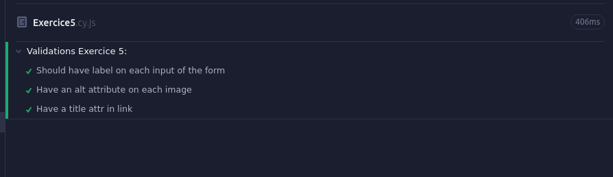
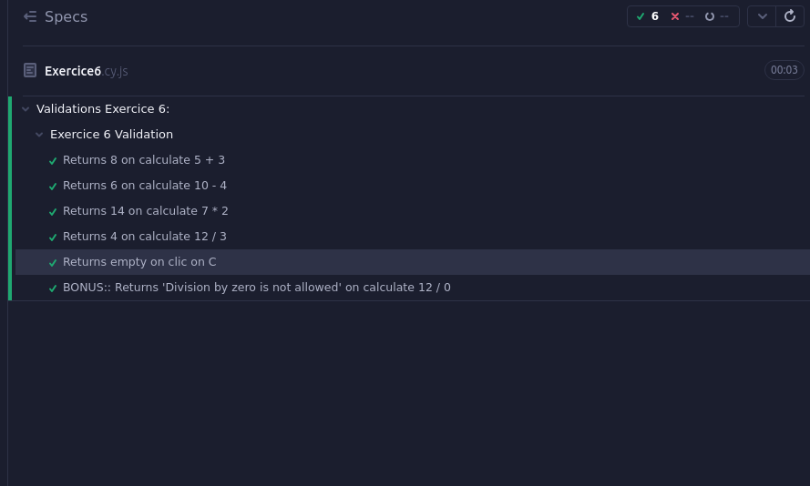
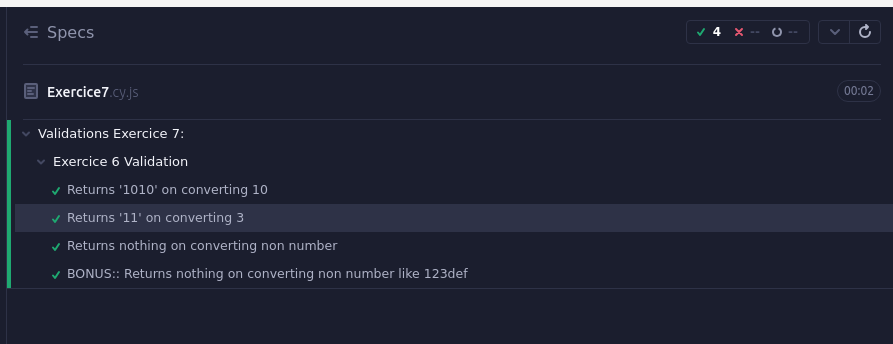

# Projet 8 : Testez vos compétences, les algorithmes en Javascript

Pour commencer le projet lancez la commande `npm install` qui installera les dépendences du projet.

Ensuite vous pourrez réaliser les différents exercices.

Pour vérifier que votre exercice est correctement réalisé vous n'avez qu'à lancer la commande `npm start` puis la commande `npm run test` vous verrez alors s'afficher l'application `Cypress`. Sélectionnez `E2E Testing` puis sélectionnez le navigateur dans lequel vous voulez lancer vos test.

Si votre code est correctement réalisé alors les tests seront décrits en vert

---

## Screeshots:

### Exercice 1

### Exercice 2

### Exercice 3

### Exercice 4

### Exercice 5

### Exercice 6

### Exercice 7

